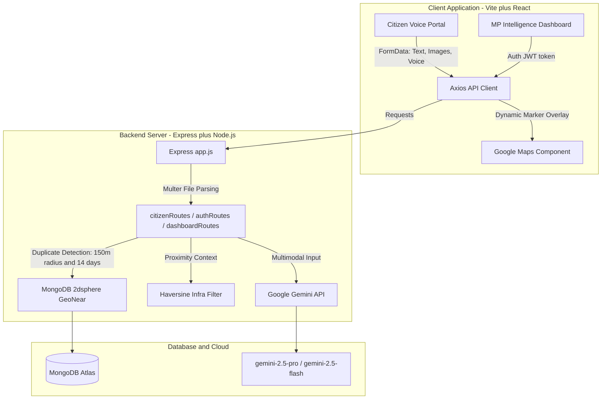

<div align="center">

# 🏛️ CivicSense AI

### Decision Support System for Members of Parliament (MPs)

**An AI-powered civic intelligence platform that turns raw citizen complaints into prioritized, data-backed action items.**

🌐 **[LIVE DEMO PORTAL (Vercel)](https://civic-sense-ai-roan.vercel.app/)** &nbsp;|&nbsp; 🖥️ **[API Server (Render)](https://civicsense-ai-88cr.onrender.com)**


</div>

---

## 📖 Overview

CivicSense AI is a next-generation civic intelligence dashboard and citizen engagement portal. It lets citizens report constituency development issues — roads, water, healthcare, sanitation, education — using **text, voice, and image uploads**.

Behind the scenes, the system connects directly to **Google Gemini AI** to:
- translate and transcribe submissions in local languages,
- classify categories and analyze urgency,
- cross-reference demographic and proximity data against critical local infrastructure (schools, hospitals, water supplies),

...and computes a live **Priority Score (1–100)** to help MPs decide what to fix first.

---

## ✨ Core Features

| Feature | Description |
|---|---|
| 🎙️ **Multimodal Analysis** | Accepts photo uploads (Gemini vision analysis) and voice notes (Gemini speech transcription + translation) in local languages. |
| 📍 **Geospatial Deduplication** | On submission, MongoDB runs a `$near` geospatial lookup (150m radius, last 14 days). Matches increment the existing report's `duplicateCount` and trigger a Priority Score recompute — no duplicate spam. |
| 🏥 **Infrastructure Overlay** | Finds nearby critical infrastructure (schools, hospitals, etc.) within 1km via Haversine distance, feeding proximity risk into Gemini's prioritization. |
| 📊 **MP Intelligence Dashboard** | A gated dashboard for MPs to view prioritized reports, hotspots, and demand clusters on a live map. |

---

## 🛠️ System Architecture



---

## 🧰 Tech Stack

- **Frontend:** React + Vite, Axios, Google Maps JS API
- **Backend:** Node.js, Express, Multer
- **Database:** MongoDB Atlas (2dsphere geospatial indexing)
- **AI:** Google Gemini (`gemini-2.5-pro` / `gemini-2.5-flash`) — multimodal vision, speech transcription, translation, prioritization
- **Auth:** JWT
- **Deployment:** Vercel (client) + Render (server)

---

## 📂 Project Structure

```
CivicSense-AI/
├── client/          # React + Vite frontend
├── server/          # Express + Node.js backend
├── .gitignore
└── README.md
```

---

## 🔑 Environment Variables

Create `.env` files in both `client/` and `server/` following the templates below.

### Backend (`server/.env`)

```env
PORT=5000
NODE_ENV=development
LOG_LEVEL=info
MONGO_URI=your_mongodb_connection_uri
GEMINI_API_KEY=your_google_gemini_api_key
JWT_SECRET=your_jwt_signing_secret
CLIENT_URL=http://localhost:5173
```

### Frontend (`client/.env`)

```env
VITE_GOOGLE_MAPS_API_KEY=your_google_maps_javascript_api_key
VITE_API_URL=http://localhost:5000/api
```

---

## 🚀 Getting Started

### 1. Install dependencies

```bash
# Install root, client and server packages
npm install
npm install --prefix client
npm install --prefix server
```

### 2. Seed demo accounts & data

```bash
# Seed the MP account (mp@civicsense.ai / password123)
npm run seed:mp --prefix server

# Seed 12 pre-categorized Bangalore requests with geolocation & duplicates
npm run seed:data --prefix server
```

### 3. Run locally

```bash
# Boots both frontend and backend concurrently
npm run dev
```

| Portal | URL |
|---|---|
| Citizen Portal | `http://localhost:5173/citizen` |
| MP Dashboard (gated) | `http://localhost:5173/dashboard` — log in with `mp@civicsense.ai` / `password123` |

---

## 📦 Deployment

- **Frontend** → deployed on **Vercel**, with SPA router redirection configured in `client/vercel.json`.
- **Backend** → deployed on **Render**, with build and env variable blueprints defined in `render.yaml`.

Live instances:
- Client: **https://civic-sense-ai-roan.vercel.app/**
- API: **https://civicsense-ai-88cr.onrender.com**

> ⚠️ The Render free-tier instance may spin down when idle — the first API request after inactivity can take 30–50s to wake up.

---

## 🗺️ Roadmap

- [ ] SMS-based reporting for low-connectivity areas
- [ ] Multi-constituency support for larger dashboards
- [ ] Public transparency view (aggregate stats without PII)

---

## 🤝 Contributing

Contributions, issues, and feature requests are welcome. Feel free to fork the repo and open a pull request.

## 📄 License

This project is licensed under the MIT License.
